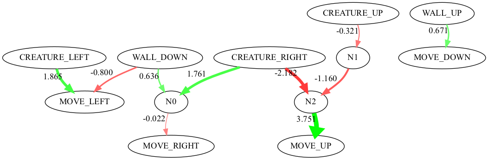

# README

This project simulates the evolutionary life cycle. Creatures have small neural network brains that are randomly created. The simulator lets from live for a certain period of time, split into 'ticks'. In each tick a creature uses its brain to decide upon an action. At the end of each period of time (generation), creatures are 'selected' based on a specific criteria. Currently, the only criteria is that they are on the left half of the screen. Those that are selected live, mutate, and reproduce. Those that are not selected die and do not reproduce. Then a new generation begins with the offspring of the previous generation.

## Example


Start of generation 1


End of generation 10


End of generation 50


A randomly generated brain



## Building

The build requires a standard C11 compiler, I strongly prefer clang but gcc should work. The simulator uses 2 libraries, popt and zlib. popt is used for command line option parsing, and will eventually be replaced with a hand written version. zlib will be used to compress images, it is not currently used but it is required to build.

linux install

```
sudo apt-get install popt zlib clang 
```

macos install

```
brew install popt zlib llvm
```

If you have installed everything to their default directories, just running `make` from the project root should properly build everything. IF you do not have everything in the default directories, I expect that you know how to modify the Makefile to make it work for your system. All the configuration is done in `options.mk`, it should be trivial to make it match your system.

## Running

Executing `./build/bin/evo` will run a simulation with default parameters. Running `./build/bin/evo --help` will show all the options to customize the simulator. 

### WARNING

If you tweak the settings too high, the simulator will take a very long time to run and will likely consume all available storage.

## NOTE

This project is under heavy active development and is not in a stale state yet, but I have lots of requests to make it public. Furthermore, past this point in the README is my silly notes to myself, read them if you wish but understand them in that context.

## FFMPEG Experimenting

```
./build/bin/evo -g 2 -o /Volumes/Evo/test --callback-tick=1 --callback-tick-freq=1 -w 256 -h 256 -n 10000 -g 30 -t 300 -c 20
./build/bin/evo -g 2 -o /Volumes/Evo/test --callback-tick=1 --callback-start=0 --callback-end=0 --callback-tick-freq=10 -w 256 -h 256 -n 3000 -g 50 -t 300 -c 20
ffmpeg -y -r 30 -f image2 -s 256x256 -pattern_type glob -i "/Volumes/Evo/test/gen_*_tick_*.bmp" -vcodec libx264 -crf 25 -pix_fmt yuv420p test.mp4
```

view compressed file
```
./build/bin/zpipe -d </Volumes/Evo/test2/gen_0001_tick_0100.bmp.gz | open -a Preview.app -f
```

`du -ch /Volumes/Evo/test2/*.bmp` vs `du -ch /Volumes/Evo/test2/*.bmp.gz`


ffmpre compressed files
```bash
cat /Volumes/Evo/test2/gen_*_tick_*.bmp.gz | ./build/bin/zpipe -d | ffmpeg -y -f image2pipe -r 30000/1001 -pix_fmt bgr24 -s 256x256 -c:v bmp -i - -c:v libx264 -crf 25 -pix_fmt yuv420p test2.mp4

# explore adding to the end of an existing video, may be way to solve the stream pipe problem


ffmpeg -y -r 30 -f image2 -s 256x256 -pattern_type glob -i "/Volumes/Evo/test/gen_*_tick_*.bmp" -vcodec libx264 -crf 25 -pix_fmt yuv420p test.mp4
```


## TODO

- Commandline args
  - selection criteria
  - species
  - add checking if varaibales go out of bounds, like exceeding max generations
- Expand what species do
- add more genes
- add more complex environments
  - add obstacles to the path
  - load from a file description?
- write a better expression algorithm that doesn't use recursion, look into using actual matrices
- threading
  - dynamically allocate threads instead of statically
  - improve memory allocation in threads, i think thats part of what slows down threading
  - we can make better threading with more complex threading, where we tile the grid, and then only synchronize on tile crossing, this will be after other optimizations because it will be a pain
- make a primitive language to describe simulations
  - language describes the environment, and how the simulation should run
  - can modify the simulation mid run
  - maybe we write in something like python, that generates a C file that you compile?
- report stats of the generations?
  - how many survive
  - genetic diversity
  - view the most popular brain wiring
- compress bmps
  - https://zlib.net/zlib_how.html
  - rewrite compression script to do memory to file
  - add bmp write to memory
  - maybe look at exporting as ppm?
    - https://stackoverflow.com/questions/32024859/piping-ppm-files-to-ffmpeg-to-create-movie-in-c
- make a formal movie script that adds parameters to the video?
- fix makefile dependencies
- https://shotstack.io/learn/use-ffmpeg-to-convert-images-to-video/
- look into getting rid of libraries
  - get rid of popt, make ur own arg parser from scratch :)
  - get rid of zlib, write ur own custom compression scheme
    - write bmp rle compression. rudimentary but probably sufficent
    - either use RLE8 with a color table and indexing, or use 24 bit RLE
- improve build system cross compaitabily and workiung out of the box
    fix libraru includes, things are included where they shouldnt due to overrides of LDLIBS
- wasm
- video encode
- https://www.ffmpeg.org/doxygen/3.3/encode_video_8c-example.html


make -B BUILD=omp_build VERBOSE=1 CFLAGS="-fopenmp -mpopcnt" LDLIBS="-lomp"
